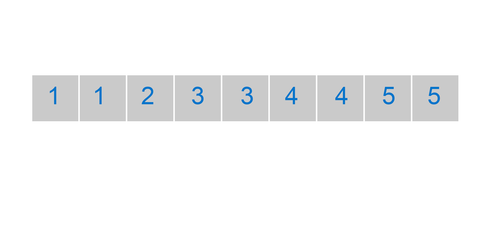
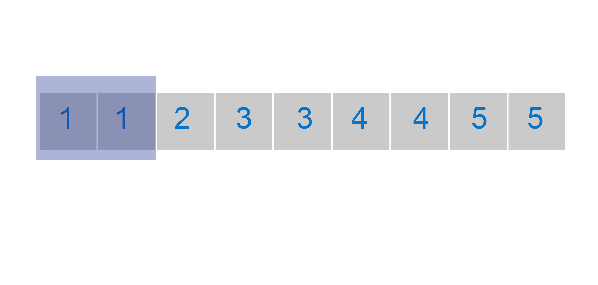
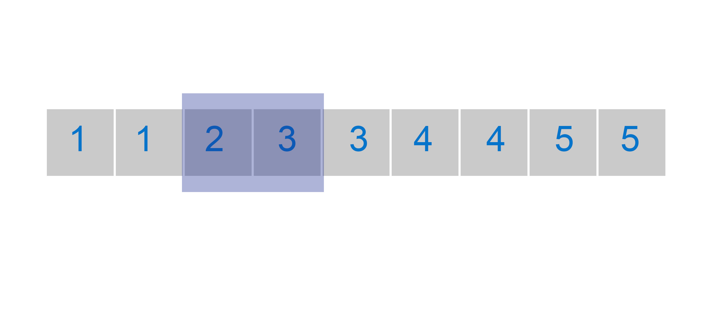
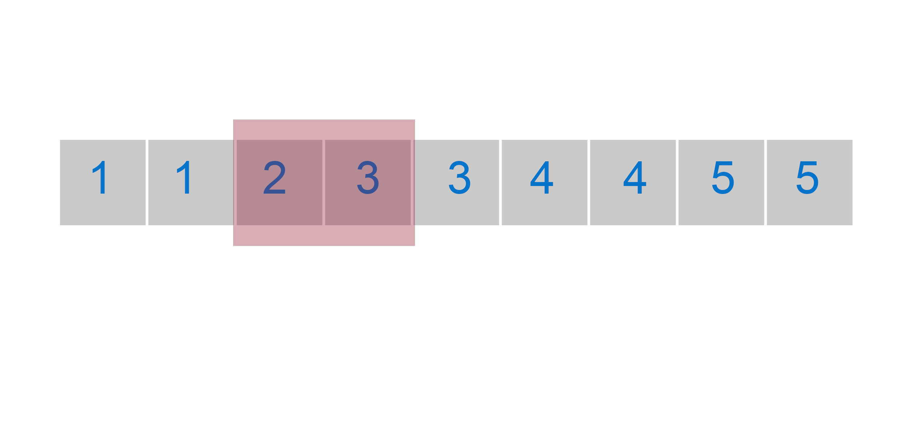
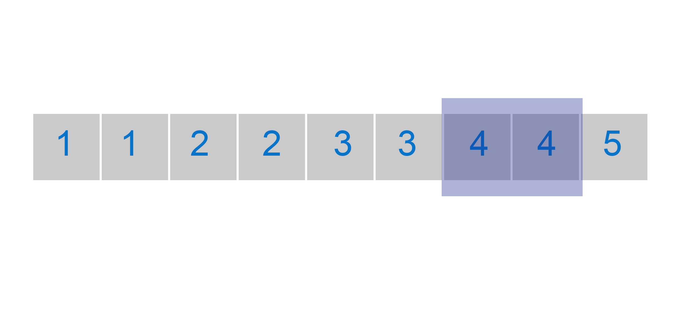

# Problem1: Find a single element in an order array.

My algorithm is based on finding the unique element in pairs

we compare if the current and subsequent value of pair are identical

When we find a different value of the pair,we know that we have found the unique value.

There is the case where the unique value is in the final position of the array, in this case if we are in the last pair of the array and we have not found the value, then the value is in the last position

