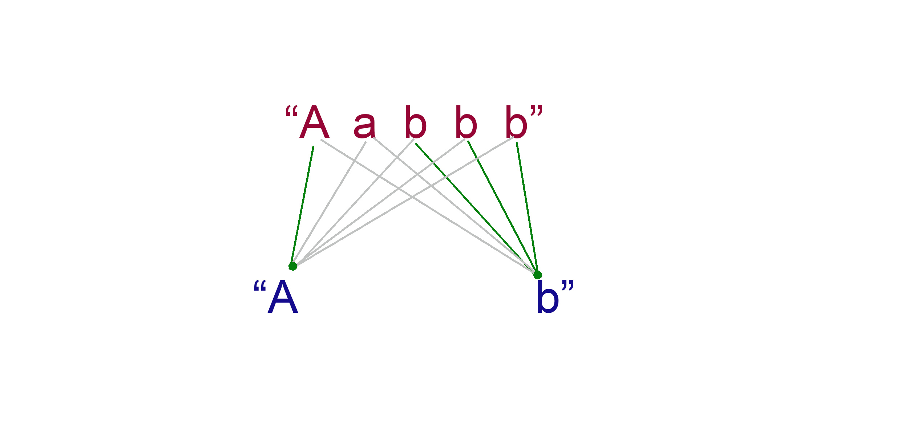

# Problem 3: Jewels and stones
My algorithm is very simple, I simply compare character by character of both strings, and if we find that the characters are equal, I increase a counting variable, which tells me the number of characters in common.

